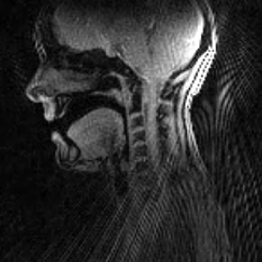

# rtMRI-1D-Tube-SpeechSynthesizer

This repository provides a MATLAB-based toolkit for synthesizing speech by coupling a 1D acoustic tube model of the vocal tract with a glottal source (either real EGG recordings or a parameterized Rosenberg waveform). The core 1D wave-solver and synthesis framework are based on the work of Matt Montag (see [Academic Speech Synthesis](https://www.mattmontag.com/projects-page/academic/speech)), extended here to ingest real articulatory data and drive more biologically realistic sources.

Key features include:

1. **Articulatory data from rtMRI**  
   We extract vocal tract area functions from real-time MRI recordings using the method of Proctor et al. (Interspeech 2010). This supplies your tube model with physiologically grounded geometry at each time frame.

2. **Flexible glottal excitation**  
   — **Electroglottography (EGG):** import your EGG waveforms to drive the glottal boundary condition directly  
   — **Rosenberg model:** generate a classic Rosenberg-shaped glottal pulse train with controllable pitch, tension, and breathiness  

3. **End-to-end workflow**  
   From raw rtMRI frames → area-function → tube geometry → glottal excitation → acoustic output → WAV

## Example Outputs

Below is the rtMRI frame that was used to extract the area-function for these demos, followed by two short audio clips: one driven by the Rosenberg glottal model, the other by a real EGG recording.

---

### rtMRI Frame

  

---

### Rosenberg-Driven Synth

**Listen/download:** [example_rosenberg.wav](data/aa_with_rosenberg.wav)

---

### EGG-Driven Synth

**Listen/download:** [example_egg.wav](data/aa_with_egg.wav)

## References

- Proctor, J., Story, B. H., & Ho, S. (2010). **Extraction of vocal tract area functions from real-time MRI**. In *Proceedings of Interspeech 2010*. Retrieved from https://www.isca-archive.org/interspeech_2010/proctor10_interspeech.pdf  

- Rosenberg, A. E. (1971). **Effect of glottal pulse shape on the quality of natural vowels**. *The Journal of the Acoustical Society of America*, 49(2 B), 583–590.  

